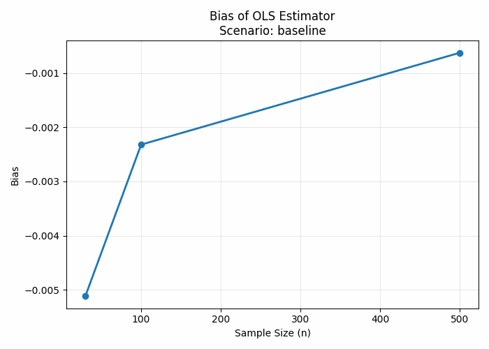
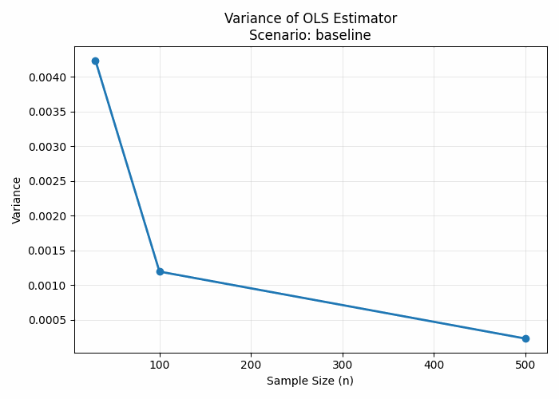
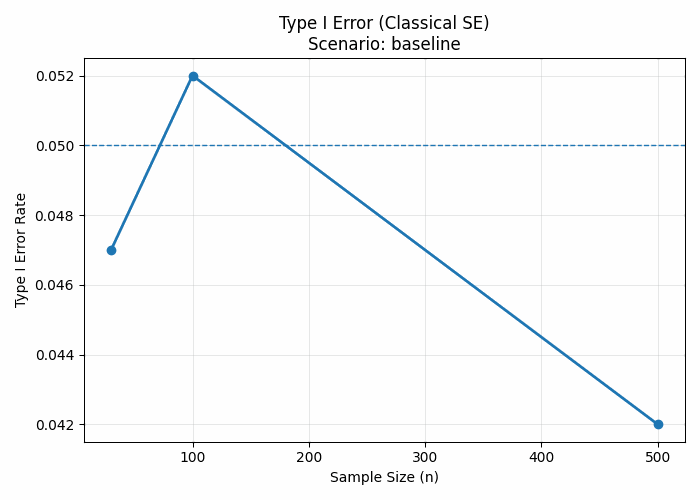
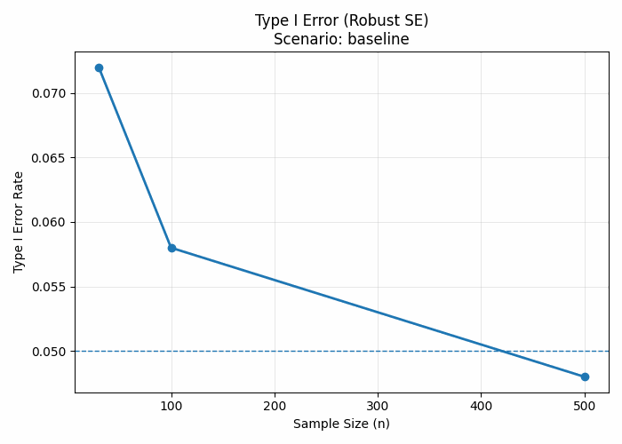
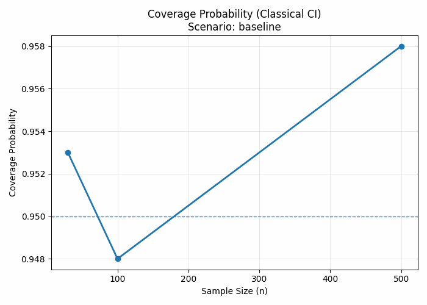
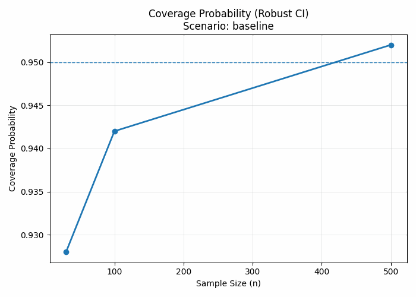

# When Statistical Assumptions Fail  
### Monte Carlo Evidence on the Fragility of OLS Inference

Ordinary Least Squares (OLS) regression is a cornerstone of applied statistics and data science. While OLS coefficient estimates are often interpreted at face value, the **validity of statistical inference critically depends on a set of strong assumptions**—assumptions that are frequently violated in real-world data.

This repository presents a **Monte Carlo simulation study** that systematically examines how violations of classical OLS assumptions affect statistical inference, even when point estimates appear stable.

---

## 1. Research Questions

This project addresses the following questions:

- Does OLS remain unbiased when classical assumptions fail?
- How do assumption violations affect:
  - estimator variance,
  - Type I error rates, and
  - confidence interval coverage?
- Does increasing sample size resolve inferential distortions?
- To what extent do robust standard errors correct these issues?

---

## 2. Simulation Framework

### 2.1 Data Generating Process

The population model is defined as:

Y = β₀ + β₁X + ε

with:
- β₀ = 2
- β₁ = 3
- X ~ Uniform(0, 10)

**Importantly, the regressor \(X\) is held fixed across all scenarios.**  
Only the **error structure** varies, ensuring that all observed effects arise solely from assumption violations rather than changes in the design matrix.

---

### 2.2 Sample Sizes

Simulations are conducted under three sample-size regimes:

- **n = 30** — small sample  
- **n = 100** — moderate sample  
- **n = 500** — large sample  

This design explicitly contrasts finite-sample behavior with asymptotic intuition.

---

### 2.3 Error Scenarios

Each scenario violates **one classical OLS assumption at a time**:

| Scenario | Assumption Violated |
|--------|---------------------|
| Baseline | None |
| Non-normal | Normality of errors |
| Heteroskedastic | Constant variance |
| Autocorrelated | Independence |

---

### 2.4 Monte Carlo Design

For each combination of scenario and sample size:

1. Generate synthetic data
2. Estimate the OLS model
3. Compute classical and robust standard errors
4. Repeat for many Monte Carlo replications
5. Evaluate empirical inferential properties

All hypothesis tests use:
- **Significance level:** 0.05
- **Confidence level:** 95%

---

## 3. Evaluation Metrics

Inference quality is assessed using:

- **Bias** of β^​1​
- **Variance** of the estimator
- **Type I error rate**
- **Coverage probability** of confidence intervals
- Comparison between **classical** and **robust** inference

---

## 4. Results

### 4.1 Bias



**Finding:**  
Across all scenarios and sample sizes, the OLS estimator of β₁ remains approximately unbiased.

**Interpretation:**  
Violations of classical assumptions do **not** invalidate the consistency of the OLS point estimator.

---

### 4.2 Variance



**Finding:**  
Estimator variance decreases with increasing sample size but is inflated under heteroskedasticity and autocorrelation.

**Interpretation:**  
Assumption violations reduce estimator efficiency, particularly in small samples.

---

### 4.3 Type I Error — Classical Inference



**Finding:**  
Classical OLS inference exhibits substantial over-rejection when assumptions are violated.

**Interpretation:**  
Nominal significance levels cannot be trusted under model misspecification, even in moderately large samples.

---

### 4.4 Type I Error — Robust Inference



**Finding:**  
Robust standard errors substantially improve Type I error control.

**Interpretation:**  
Robust methods mitigate—but do not entirely eliminate—inferential distortions, especially in small samples.

---

### 4.5 Coverage Probability

  


**Finding:**  
Classical confidence intervals systematically undercover the true parameter under assumption violations.  
Robust confidence intervals improve coverage but may still deviate from the nominal level in small samples.

---

## 5. Key Takeaways

- OLS point estimates may remain stable under assumption violations.
- Statistical inference is far more sensitive than estimation.
- Larger sample sizes reduce—but do not guarantee—valid inference.
- Robust standard errors are necessary but not sufficient.
- Diagnostic checks should be treated as essential, not optional.

---

## 6. Repository Structure

```
when-statistical-assumptions-fail/
├── README.md
├── LICENSE
│
├── src/
│   ├── data_generation.py
│   ├── simulation.py
│   ├── evaluation.py
│   ├── runner.py
│   └── visualization.py
│
└── results/
    ├── figures/
    ├── summary/
    └── raw/
```
---

## 7. How to Run the Simulation

This project is designed for reproducible Monte Carlo experimentation rather than end-user deployment.

### Requirements
- Python ≥ 3.9
- numpy
- pandas
- scipy
- statsmodels
- matplotlib

### Execution Logic

The simulation pipeline follows this logical order:

1. Data Generation — data_generation.py
2. Simulation Engine — simulation.py
3. Evaluation — evaluation.py
4. Runner Script — Runner.py
5. Visualization — visualization.py

All outputs are saved in the results/ directory.

---

## 8. Credit

I Made Pandu Pujangga Sakti

This project was developed as a personal research focusing on statistical inference and Monte Carlo simulation.

Acknowledgements

This work draws inspiration from classical and modern literature in statistics and econometrics, including:

- The Gauss–Markov theorem
- Robust inference methods (White, Newey–West)
- Monte Carlo simulation methodology
